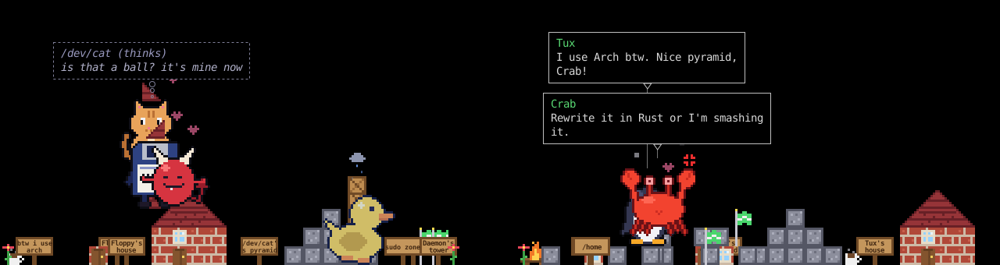
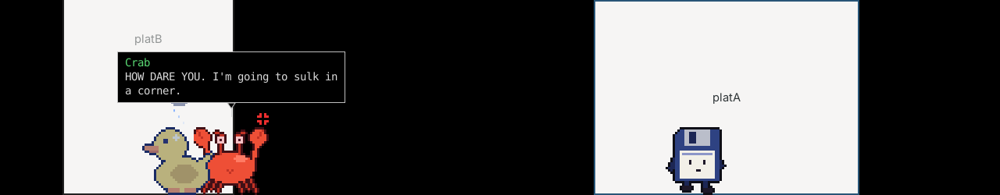
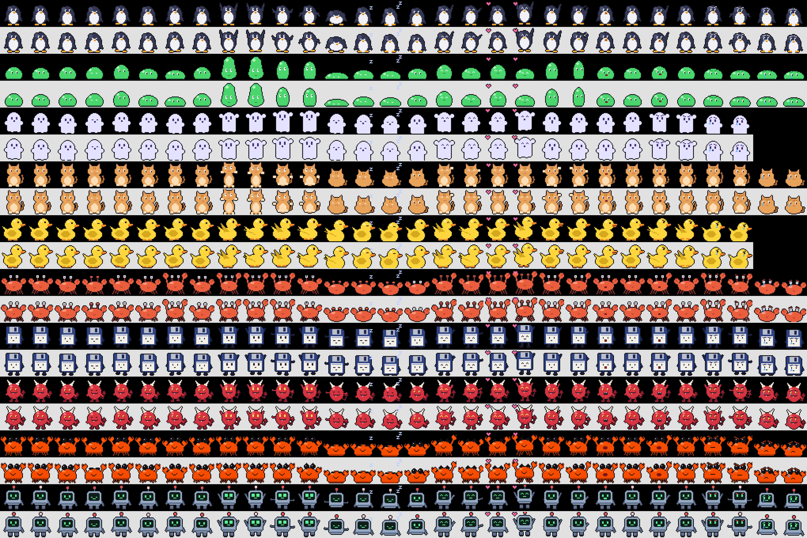
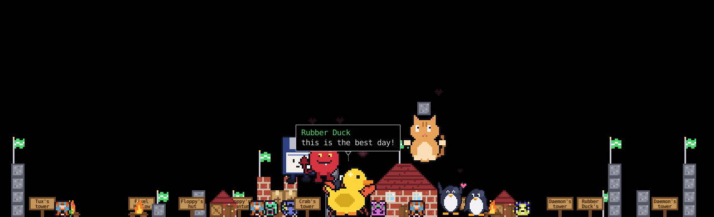

# deskpet




Little pets that live on your Wayland desktop. They:

- walk along the bottom of the screen;
- climb the screen edges and **your windows**, stand on top of them and ride along when you move a window;
- crawl upside down along the ceiling;
- **build things** out of blocks: houses, towers, pyramids, forts, campfires, gardens;
- **put things down**: flowers, signs with things written on them, their favourite items;
- chase a ball, play tag, dance, nap (in a house they built, if they have one), sit around the campfire;
- have **moods**: happy, sad or angry, depending on what you say to them and how you treat them;
- make **friends** (and enemies), become **partners** and have **babies** that grow up;
- found **towns** together and build them up: a town hall, a market, houses, a well, a campfire, a statue...;
- **invent** new kinds of buildings and gadgets every 10 minutes (or every hour, you choose);
- **talk** to you and to each other through a local LLM.

Each pet knows what it's doing, how it feels, what just happened to it, the time, how hard your CPU is working and which windows are open. It remembers you, its moods and everything it built between restarts.

Built-in pets:

| pet | |
|---|---|
| `tux` | a cheerful penguin who uses Arch btw |
| `slime` | a sleepy blob that eats stray bytes |
| `zombie` | a `<defunct>` zombie process ghost; floats down slowly |
| `cat` | /dev/cat, smug, knocks your files off the desk |
| `duck` | a rubber debugging duck |
| `crab` | wants to rewrite everything in Rust |
| `floppy` | a grumpy 1.44 MB floppy disk grandpa |
| `daemon` | a sneaky background process that lives in systemd |

You can also draw your own.

| moods | the pets |
|---|---|
|  |  |

## Install (Arch)

```sh
tar xf deskpet.tar.gz && cd deskpet
./install.sh          # installs deps with pacman if missing, puts `deskpet` in ~/.local/bin
```

If you'd rather install it as a package, use `makepkg -si` with the PKGBUILD (it downloads the release from GitHub).

Or straight from git:

```sh
git clone https://github.com/rxvy-dev/deskpet && cd deskpet && ./install.sh
```

Dependencies: `python-gobject python-cairo gtk3 gtk-layer-shell`

## Run

```sh
deskpet                          # Tux
deskpet --pet slime
deskpet --pet tux,cat,crab,floppy   # several at once (they'll chat)
deskpet --list                   # installed pets
```

The installer also adds a **deskpet** app launcher. Right-click it in your launcher for *The whole gang*, */dev/cat*, *Crab* and *Stop all pets*.

To start it with your session, add `deskpet &` to whatever your WM runs at startup.

| do this | it does |
|---|---|
| left-drag | picks it up (it dangles); let go while moving to **throw** it. Throwing it 3 times in a minute makes it angry |
| click | it waves / gets happy (angry pets don't like being poked) |
| rub the mouse back and forth over it | petting: makes it happy, slowly calms an angry pet |
| **double-click** | talk to it: a chat box opens and it answers in a speech bubble (Esc closes) |
| right-click a pet | tty menu with these pages: **build**, **place**, **do** (sleep, dance, play, climb...), **pets** (switch, add, remove), **world** (throw a ball, clean up), plus cheer up and talk |
| drag / right-click a block or item | move it, throw it, kick it, or remove it (or a whole building) |
| ignore it | it gets sleepy, and after 10 minutes a bit lonely |

### Options

| flag | |
|---|---|
| `--scale N` | bigger/smaller pixels (packs default to 3) |
| `--layer top\|overlay\|bottom` | `top` (default) sits above windows. `overlay` is also above fullscreen apps. `bottom` keeps it behind your windows |
| `--monitor N` | which monitor (0, 1, ...) |
| `--floor PX` | keep it N pixels above the bottom edge |
| `--sleep-after SEC` | how long until it gets sleepy (default 120) |
| `--no-climb` | stay on the ground |
| `--no-chatter` | pets don't start conversations with each other |
| `--ask PET "msg"` | ask a pet something from the terminal (tests your LLM setup) |
| `--config` | create/print `~/.config/deskpet/config.json` |
| `--window` | terrarium mode: a normal window the pet lives in |
| `--forget` | start fresh this time (doesn't load moods or builds) |
| `--reset` | delete everything deskpet remembers |

## Moods

Every pet has a happy, a sad and an angry level, and these change over time.

| what happens | effect |
|---|---|
| insults, "shut up", "I hate you"... | **angry**: angry face, red tint, an anger mark that turns to steam when it's furious. It stomps around, shoves other pets out of the way, and knocks down things others built. |
| "bye", "I'll replace you", being ignored, its house getting smashed | **sad**: teary face, blue tint, a rain cloud over its head. It sulks, sits, and walks slowly. |
| compliments, "sorry", petting, finishing a building, playing | **happy**: hearts, dancing, hopping. It builds and decorates more. |

- With an LLM running, the pet also decides for itself how your message made it feel.
- Pets talking to each other affect each other's moods too.
- Moods slowly fade back to normal.
- "sorry", petting, or right-click → *cheer up* calms an angry pet down.

## Building and placing things

- Pets pick a free spot and build one block at a time. For each block they go dig one up, carry it over and toss it into place. Other pets often come and help.
- Rubble lying around gets picked up and reused.
- A finished building gets a sign with a name, which the pet comes up with if an LLM is running. Pets then use what they built: they sleep in houses, huts, forts, igloos and crypts, sit around campfires, and stand on towers.
- You can ask them to build or do things in chat ("build a house", "plant some flowers", "go to sleep", "let's play"). The model can also decide to do things itself.
- Blueprints: `house tower wall pyramid campfire garden fort hut igloo crypt pkgstack`.
- Props: blocks (brick, crate, stone, window, door, roof), flag, campfire, flowers, mushroom, sign, fish, yarn, ball, package, coffee. They live in `props/`; `tools/gen_props.py` makes them, and you can add your own to `~/.local/share/deskpet/props/props.json`.

## Families, towns and inventions



**Friendships:** every pair of pets has a relationship from -100 to 100, which changes as they live together:

| raises it | lowers it |
|---|---|
| hanging out near each other | getting shoved |
| chatting | a grumpy chat |
| playing tag | having their building smashed |
| building the same thing | |

From that, pets become friends, best friends, rivals or enemies, and they know it. Their relationships go into every conversation.

**Families:**
- Best friends who are happy together become **partners**.
- Partners sometimes have a **baby**: a smaller version of one of them, named by the parents.
- Babies toddle after their parents, play and nap, and grow up after `grow_up_minutes`.
- Parents play tag with their kids.
- Babies are remembered and come back every time deskpet starts.

**Towns:** when three or more pets are friends (or a family), one of them founds a town.
- The town gets a name, a mayor, a welcome sign and a flag, and claims a stretch of floor.
- Residents then work through the town's to-do list together: a town hall, campfire, houses, a market, a well, a statue, a fort, plus anything someone invents.
- Friends of residents move in.
- Town land is kept free of everyone's personal builds.

**Inventions:** every `every_minutes`, a pet invents something new:
- a **building design**: a new structure generated from blocks, always physically sound. The inventor's town builds it next.
- a **gadget**: a brand-new pixel-art item with its own sprite and name. Pets put them down, and some can be kicked around like toys.

The LLM names inventions, babies and towns when it's running; otherwise pets pick from built-in names. Everything is under right-click → **inventions**, where you can build or place anything that's been invented, or ask a pet to *invent something now*. Right-click → **family & town** shows a pet's partner, kids, friends, rivals and town.

```json
"family": { "enabled": true, "max_pets": 12, "max_kids": 2, "baby_every_minutes": 15, "grow_up_minutes": 30 },
"towns": { "enabled": true, "min_members": 3, "width": 620 },
"inventions": { "enabled": true, "every_minutes": 10 }
```

Use `"every_minutes": 60` for one invention an hour.

## Climbing your windows

On **sway** and **Hyprland**, deskpet reads where your windows are, so pets can:
- climb up their sides;
- walk along their tops;
- ride along when you move one;
- fall off when a window closes.

On **[ttywm](https://github.com/rxvy-dev/ttywm)**, set `"windows_command": "ttywm windows-json"`.

For any other compositor, set `"windows_command"` in the config to a command that prints the windows as JSON in screen coordinates:

```json
[{"x": 100, "y": 200, "w": 640, "h": 480, "title": "kitty"}]
```

`"windows_offset": [x, y]` is subtracted from those coordinates, so you can use it to account for a bar at the top or left. This is how to hook up **ttywm**: give it a small IPC command that lists window rectangles.

## How it works on Wayland

Wayland doesn't let normal windows place themselves or read the global cursor position. So deskpet uses **wlr-layer-shell**: one transparent, click-through overlay that covers the monitor.

- Its input region is only the pet's visible pixels, so everything else clicks through to your windows.
- While you're dragging it, it takes the whole screen for a moment so the pet doesn't slip out from under the cursor.
- It never takes keyboard focus.
- It respects bars' reserved space.

This works on any compositor with layer-shell support: wlroots-based ones (sway, Hyprland, river, labwc, Wayfire), niri, KDE and so on.

If the compositor doesn't support layer-shell, deskpet says so and opens a **terrarium** window instead.

## Talking (local LLM)

```sh
./setup-llm.sh
```

The script:
1. installs **Ollama** (`ollama-cuda` on NVIDIA, `ollama-rocm` on AMD) and starts it;
2. lets you pick an **abliterated** model from huihui_ai:
   - `qwen3.5-abliterated:9b` (6.6 GB) is the default;
   - `:4B` (3.3 GB) is lighter if you game at the same time;
   - `gemma3-abliterated:1b` is tiny;
3. writes the model into your deskpet config and says hi.

Everything runs on your machine. Ollama unloads the model from VRAM 5 minutes after the last message.

- **You → pet:** double-click a pet, or right-click → *talk...*. Each pet remembers your recent chat and the last things that happened to it, even after a restart.
- **Pet ↔ pet:** every 45–150 s two pets walk up to each other and swap a few lines, each in its own personality. Right-click → *chat with a pet* starts one right away.
- **Thoughts:** now and then a pet thinks out loud (dashed bubble) about what it's doing.
- **No LLM running?** Pets still chat and think using built-in lines, and moods still react to what you type. If you talk to one directly, the bubble tells you what's wrong (for example, Ollama isn't running or the model isn't downloaded).

`~/.config/deskpet/config.json` (`deskpet --config` creates it):

```json
{
  "llm": {
    "enabled": true,
    "backend": "ollama",
    "url": "http://127.0.0.1:11434",
    "model": "huihui_ai/qwen3.5-abliterated:9b",
    "temperature": 0.9,
    "max_tokens": 160,
    "keep_alive": "5m",
    "think": false
  },
  "chatter": { "enabled": true, "min_gap": 45, "max_gap": 150, "turns": 4 },
  "thoughts": { "enabled": true, "min_gap": 70, "max_gap": 200, "use_llm": true },
  "world": { "build": true, "decorate": true, "max_buildings": 6, "max_decor": 16, "max_props": 160, "smash": true },
  "climb_windows": true,
  "windows_command": "",
  "windows_offset": [0, 0],
  "remember": true,
  "your_name": "",
  "extra_prompt": ""
}
```

- `"backend": "openai"` works with any OpenAI-compatible server (llama.cpp `llama-server`, LM Studio, vLLM...). Set `url` to its address and `api_key` if it needs one.
- `your_name` is what the pets call you.
- `extra_prompt` is added to every pet's instructions (house rules, a running joke...).

## Make your own pet

```sh
deskpet --new mypet              # copies Tux as a template into ~/.local/share/deskpet/pets/mypet
deskpet --new mypet --from slime # or start from another pet
```

Then paint over the PNGs in any editor (LibreSprite, Pixelorama, Aseprite, GIMP, Krita...) and test it:

```sh
deskpet --check mypet            # lists every animation, frame sizes, fallbacks and mistakes
deskpet --pet mypet
```

### The animations

| name | plays when | required |
|---|---|---|
| `idle` | standing around | **yes** |
| `walk` | walking | **yes** |
| `held` | dangling from your cursor | no → uses `fall`, then `idle` |
| `fall` | falling / thrown | no → `held`, then `idle` |
| `land` | hitting the ground (~0.45 s) | no → `sit`, then `idle` |
| `sleep` | napping | no → `sit`, then `idle` |
| `sit` | sitting | no → `idle` |
| `wave` | clicked | no → `happy`, then `idle` |
| `happy` | petted | no → `wave`, then `idle` |
| `climb` | climbing a screen edge | no → won't climb |
| `talk` | speaking | no → `idle` |
| `angry` | standing around angry | no → `idle` (+ red tint) |
| `sad` | sitting / standing around sad | no → `sit`, then `idle` (+ blue tint) |

So a pet can be as small as two animations. Add the others when you feel like it.

### Rules for frames

- Use PNGs with a transparent background.
- Draw it **facing right**. It's mirrored automatically when walking left. If you drew it facing left, set `"faces": "left"`.
- Frames are anchored bottom-centre, so different animations can be different sizes.
- For pixel art, draw small (32×32 is good) and set `"scale": 3` to get crisp, unblurred pixels.
- Clicks only hit the opaque pixels, so empty corners of a frame click through.

### pet.json

```json
{
  "name": "My Pet",
  "scale": 3,
  "speed": 60,
  "climb_speed": 45,
  "gravity": 1.0,
  "bounce": 0.35,
  "hover": 0,
  "faces": "right",
  "animations": {
    "idle":  { "frames": ["idle_0.png", "idle_1.png"], "fps": 3 },
    "walk":  { "sheet": "walk_strip.png", "count": 4, "fps": 8 },
    "held":  { "frames": ["held_0.png"], "fps": 1 }
  }
}
```

Give it a voice with `"personality"`. This is how it talks with an LLM, for example `"You are Bob, a grumpy toaster who..."`. Add `"lines"`, a list of things it says with no LLM running.

- `"items"`: props it likes to put down, for example `["fish", "flower_red"]`.
- `"builds"`: what it likes to build, for example `["house", "tower"]`.

Each animation is either a list of `frames` or a horizontal sprite strip: `sheet` plus `count`, the number of frames in the strip.

- `speed`: walking speed in screen pixels per second.
- `gravity`: `1` is normal; `0.25` falls slowly and floats.
- `bounce`: how springy landings are, from 0 to 0.9.
- `hover`: how many pixels it floats above the floor.

Pets are looked up in `~/.local/share/deskpet/pets/`, then `~/.config/deskpet/pets/`, then the built-in ones. `--pet` also accepts a path to a folder.

The built-in sprites are generated by `tools/gen_sprites.py` (needs `python-pillow`) if you want to tweak them.

## License

MIT. See [LICENSE](LICENSE). All the sprites are original pixel art made for this project (`tools/gen_sprites.py`, `tools/gen_props.py`).

Made by [rxvy-dev](https://github.com/rxvy-dev). Works great on [ttywm](https://github.com/rxvy-dev/ttywm).
